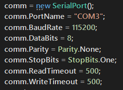

# Virtual Drone详细设计报告

## O、组员分工

### 原分工：

**Unity3D小组**：邵军阳、徐亦舜

**无人机树莓派小组**：祝冠琪、赵瑞

### 实际分工

**查找资料**：徐亦舜、祝冠琪、赵瑞、邵军阳

**PPT制作**：祝冠琪、赵瑞、邵军阳

**无人机通信**：祝冠琪

**无人机安装**：祝冠琪，赵瑞

**Unity地面站**：邵军阳  

## O.5、立项依据

无人驾驶飞机简称“无人机”，英文缩写为UAV，是利用无线电遥控设备和自备的程序控制装置操纵的不载人飞机，或者由车载计算机完全地或间歇地自主地操作。

与有人驾驶飞机相比，无人机往往更适合那些太“愚钝，肮脏或危险”的任务。无人机按应用领域，可分为军用与民用。军用方面，无人机分为侦察机和靶机。民用方面，无人机+行业应用，是无人机真正的刚需；目前在航拍、农业、植保、微型自拍、快递运输、灾难救援、野生动物、监控传染病、测绘、新闻报道、电力巡检、救灾、影视拍摄、制造浪漫等等领域的应用，大大的拓展了无人机本身的用途，发达国家也在积极扩展行业应用与发展无人机技术。

无人机这种可以在物理空间进行灵活的移动的设备能为我们的生活提供许许多多的便利。随着无人机成本的不断降低，未来的人类将会更容易拥有这类设备，而目前无人机的使用仍不够方便，控制无人机仍然需要遥控器这些笨重的仪器，而无人机的定位也不够直观（往往是卫星地图上显示一个点，这无法展现无人机附近的真实物理空间）。无人机的进一步便利化是市场的诉求，首先要实现的就是无人机的便利操作（只需要一台人手皆备的智能设备，例如电脑或者手机）以及无人机附近空间的3D可视化。

我们的项目目标就是实现无人机的电脑操控和3D地图可视，这是市场诉求的初步满足，也是一个很好的前沿课题。

## 一、项目模块

### 1、无人机

**无人机：**无人驾驶飞机的简称，缩写为“UAV”。是一种无线遥控的无人驾驶飞机。2016年无人机作为消费电子类的重点戏迅速点燃了整个消费市场,一时间家喻户晓,在引起消费者狂热追捧的同时,国内外的厂商也前赴后继地杀入无人机市场,力求在无人机市场占有自己的一席之地。

### 2、树莓派

**树莓派**（英语：**Raspberry Pi**），是一款基于Linux的[单片机](https://zh.wikipedia.org/wiki/%E5%8D%95%E7%89%87%E6%9C%BA)电脑。它由[英国](https://zh.wikipedia.org/wiki/%E8%8B%B1%E5%9C%8B)的树莓派基金会所开发，目的是以低价[硬件](https://zh.wikipedia.org/wiki/%E7%A1%AC%E4%BB%B6)及[自由软件](https://zh.wikipedia.org/wiki/%E8%87%AA%E7%94%B1%E8%BB%9F%E9%AB%94)促进学校的基本[计算机科学](https://zh.wikipedia.org/wiki/%E7%94%B5%E8%84%91%E7%A7%91%E5%AD%A6)教育。树莓派配备一枚[博通](https://zh.wikipedia.org/wiki/%E5%8D%9A%E9%80%9A)（Broadcom）出产的[ARM架构](https://zh.wikipedia.org/wiki/ARM%E6%9E%B6%E6%A7%8B)700MHz BCM2835处理器，256MB[內存](https://zh.wikipedia.org/wiki/%E5%85%A7%E5%AD%98)（B型已升级到512MB内存），使用[SD卡](https://zh.wikipedia.org/wiki/SD%E5%8D%A1)当作存储媒体，且拥有一个[Ethernet](https://zh.wikipedia.org/wiki/Ethernet)、两个[USB接口](https://zh.wikipedia.org/wiki/USB%E6%8E%A5%E5%8F%A3)、以及[HDMI](https://zh.wikipedia.org/wiki/HDMI)（支持声音输出）和[RCA端子](https://zh.wikipedia.org/wiki/RCA%E7%AB%AF%E5%AD%90)输出支持。树莓派面积只有一张信用卡大小，体积大概是一个火柴盒大小，可以运行像《[雷神之锤III竞技场](https://zh.wikipedia.org/wiki/%E9%9B%B7%E7%A5%9E%E4%B9%8B%E9%94%A4III%E7%AB%9E%E6%8A%80%E5%9C%BA)》的游戏和进行[1080p](https://zh.wikipedia.org/wiki/1080p)视频的播放。操作系统采用开源的[Linux](https://zh.wikipedia.org/wiki/Linux)系统：[Debian](https://zh.wikipedia.org/wiki/Debian)、[ArchLinux](https://zh.wikipedia.org/wiki/ArchLinux)，自带的[Iceweasel](https://zh.wikipedia.org/wiki/Iceweasel)、[KOffice](https://zh.wikipedia.org/wiki/KOffice)等软件，能够满足基本的网络浏览、文字处理以及电脑学习的需要。

### 3、Unity

**Unity3D**是由Unity Technologies开发的一个让玩家轻松创建诸如三维视频游戏、建筑可视化、实时三维动画等类型互动内容的多平台的综合型游戏开发工具，是一个全面整合的专业游戏引擎。Unity类似于Director,Blender game engine, Virtools 或 Torque Game Builder等利用交互的图型化开发环境为首要方式的软件。其编辑器运行在Windows 和Mac OS X下，可发布游戏至Windows、Mac、Wii、iPhone、WebGL（需要HTML5）、Windows phone 8和Android平台。也可以利用Unity web player插件发布网页游戏，支持Mac和Windows的网页浏览。它的网页播放器也被Mac 所支持。


## 二、总体结构


## 三、具体实现

### 0、无人机的安装

因为没有现成的无人机，我们首先进行了无人机的安装，安装完如下图


接下来进行了无人机的试飞，在这一部分我们花费了很长的时间。因为网上并没有完备的QgroundControl使用资料，所以有两个不怎么注意得到的参数设置错误我们也没注意到，导致无人机一直无法正常飞行。

### 1、无人机与树莓派

#### a.树莓派与飞控的连接

首先是安装树莓派的系统，这里我们选择了 RASPBIAN STRETCH WITH DESKTOP 来作为我们的系统。

这里我们通过串口连接的方式连接两者。如下图


通过飞控的Telem2端口与树莓派相连

接下来我们安装了两个库分别是`mavproxy`和`dronekit`以及使用它们所需的库

在上面运行`sudo raspi-config`设置树莓派的serial，disable `serial login shell`，activate `serial interface`

运行如下命令连接飞控

```
sudo mavproxy.py --master=/dev/ttyS0 --baudrate 57600 --aircraft MyCopter
```

结果如下


可以看见，成功连接上了pixhwak，并且无人机现处于MANUAL状态。如图输入mode命令可以得到所有可用的状态。输入`param show`可以得到无人机的参数


为了方便起见，我们讲树莓派设置成了开机自动启动连接命令，通过编辑**/etc/rc.local**来实现

```
(
date
echo $PATH
PATH=$PATH:/bin:/sbin:/usr/bin:/usr/local/bin
export PATH
cd /home/pi
screen -d -m -s /bin/bash mavproxy.py --master=/dev/ttyS0 --baudrate 57600 --aircraft MyCopter
) > /tmp/rc.log 2>&1
exit 0
```

开机后使用`sudo screen -x`便可以查看

每一次连接，在**/home/pi/MyCopter/logs/YYYY-MM-DD directory**以下文件都会被创建

- **mav.parm** : 含有从pixhawk中读取出来的所有参数
- **flight.tlog** : 包含无人机高度，姿态等的遥测日志，可以使用一些地面站工具打开 
- **flight.tlog.raw** :上面提到的.tlog中的所有数据加上从Pixhawk收到的任何其他串行数据，可能包括非MAVLink格式的消息，如启动字符串或调试输出 

然后我们便可以在**mavproxy**中调用dronekit，输入如下语句

```
api start drone_final.py
```

就可以使用dronekit来读取和设置无人机的相关参数

#### b.串口通信

因为我们无人机与地面站之间采用的是串口通信，所以使用了如下代码

```
def Read_Data_From_Pixhawk(vehicle):
    temp = vehicle.location.global_frame
    Read_Data = ''
    j = 0
    cnt = 0
    for i in range(len(data)):
        if data[i] == ',':
            Read_Data += data[j : i]
            if cnt == 0:
                Read_Data += 'lon'
                cnt += 1
            elif cnt == 1:
                Read_Data += 'lat'
                cnt += 1
            j = i + 1
        elif i == len(data) - 1:
            Read_Data += data[j : i]
            Read_Data += 'al'
    return velocity

def Send_To_Groundcontrol(vehicle, ser):
    while True:
        Read_data = Read_Data_From_Pixhawk(vehicle)
        ser.write(Read_data)
        sleep(0.02) 
        
def recv(serial):  
    data =serial.readline()     
    return data  

def Read_From_Groundcontrol(vehicle, ser):
    while True:
        data = recv(ser)
        send_nav_velocity(vehicle, data)
        sleep(0.02)
```

其中**vehicle**是通过

```
vehicle = connect(connection_string,baud = baud_rate, wait_ready=True) 
```

而得到的一个类，这是dronekit与pixhawk通信的语句。里面含有无人机的各个参数，比如无人机的gps信息，高度，俯仰角等

**ser**是通过

```
ser = serial.Serial('/dev/ttyUSB0', 115200, timeout=0.5,bytesize=8,parity=serial.PARITY_NONE,stopbits=1)
```

打开的树莓派串口，通过这个能让树莓派与地面站通信。

##### 树莓派与飞控间串口通信

对于读取地面站发来的信号我们采用如下代码：

```
def recv(serial):  
    data =serial.readline()     
    return data  

def Read_From_Groundcontrol(vehicle, ser):
    while True:
        data = recv(ser)
        send_nav_velocity(vehicle, data)
        sleep(0.02)
```

其中**recv**函数是从串口中每0.02秒读取地面站发来的信息，然后传送给**send_nav_velocity**来设置无人机的速度。

##### 树莓派与地面站间串口通信

```
def Read_Data_From_Pixhawk(vehicle):
    temp = vehicle.location.global_frame
    Read_Data = ''
    j = 0
    cnt = 0
    for i in range(len(data)):
        if data[i] == ',':
            Read_Data += data[j : i]
            if cnt == 0:
                Read_Data += 'lon'
                cnt += 1
            elif cnt == 1:
                Read_Data += 'lat'
                cnt += 1
            j = i + 1
        elif i == len(data) - 1:
            Read_Data += data[j : i]
            Read_Data += 'alt'
    return Read_Data

def Send_To_Groundcontrol(vehicle, ser):
    while True:
        Read_data = Read_Data_From_Pixhawk(vehicle)
        ser.write(Read_data)
        sleep(0.02) 
```

先通过**Read_Data_From_Pixhawk(vehicle)**函数读取无人机的参数，其中`vehicle.location.global_frame`是全球定位信息（经纬度，高度相对于平均海平面）。读取出来以后，将它转换成**x+'lon'+y+'lat'+z+'alt'** 的格式，便于地面站接收。

#### c、设置无人机速度

```
def send_nav_velocity(self, data):
    # 生成SET_POSITION_TARGET_LOCAL_NED命令
    velocity = changedata(data) 
    msg = self.vehicle.message_factory.set_position_target_local_ned_encode(
                    0,       # time_boot_ms (not used)
                    0, 0,    # target system, target component
                    mavutil.mavlink.MAV_FRAME_BODY_NED,   # frame
                    0b0000111111000111, # type_mask (only speeds enabled)
                    0, 0, 0, # x, y, z positions (not used)
                    velocity[0], velocity[1], velocity[2], # x, y, z velocity in m/s
                    0, 0, 0, # x, y, z acceleration (not used)
                    0, 0)    # yaw, yaw_rate (not used) 
    # 发送指令
    self.vehicle.send_mavlink(msg)
    self.vehicle.flush()


def changedata(data):
    velocity = []
    j = 0
    for i in range(len(data)):
        if data[i] == ',':
            velocity.append(float(data[j : i]))
            j = i + 1
        elif i == len(data) - 1:
            velocity.append(float(data[j:i]))
    sum = (velocity[0]**2 + velocity[1]**2 + velocity[2]**2)**0.5
    for i in range(len(velocity)):
        velocity[i] = velocity / sum
    if data == '':
        velocity = [0, 0, 0]
    return velocity
```

我们使用**send_nav_velocity**函数来设置无人机速度，但因为传送过来的是字符串，所以我们先用**changedata**来得到可用的数据格式。为了简化操作，我们将最后得到的速度归一化。当我们遇到没有接收到地面站信号时，我们采用让飞机悬停的方式，即速度变为[0，0，0]。

最后因为我们树莓派与地面站之间的串口是全双工的，所以我们开两个线程

```
threads = []
t1 = threading.Thread(target=Read_From_Groundcontrol,args=(vehicle,ser))
threads.append(t1)
t2 = threading.Thread(target=Send_To_Groundcontrol,args=(vehicle,ser))
threads.append(t2)
```

这样，便可以同时进行读和写了

### 2、Unity地面站

#### 框架：StrangeIOC


我在这个项目开始的时候得到了助教的一份代码，进而了解到软件工程的一些概念，包括控制反转和MVCS设计模式。抱着循序学习的态度，我认真学习了MVCS框架和控制反转的概念，并按照这个框架进行我的设计。

##### 通信部分

串口设置：



此图中的serialport将在startcommand中初始化。


##### 其他部分

由于其他部分助教的代码已经实现得很完善（实际上我们的工作是尝试去打通这个模型的通信，所以我们的重点应该是通信），所以我没有进行大幅度的修改。但是我修正了一个错误：

原代码跑着跑着会跳出错误: Object is destroyed but you're still trying to access it.

然后我发现这段代码会直接调用tile.GetComponent()而不做异常检测，所以我加了个判断。


#### 代码

##### context：

```
injectionBinder.Bind<serialp>().ToSingleton();
injectionBinder.Bind<MySignalSend>().ToSingleton();
injectionBinder.Bind<MySignalWrite>().ToSingleton();
```

##### startcommand：（程序初始化的时候创建串口用）

```
class StartCommCommand2 : Command
    {
    	[inject]
        public serialp Serialp {get;set;}
         public override void Execute()
        {
        	Serialp.init();
        }
        private void dispose()
        {
            Serialp.dispose();
        }
	}
```


##### 信号量：（另一个信号量类似）

```
using System;
using strange.extensions.signal.impl;

namespace airplanegame
{
    public class MySignalSend : Signal<string>
    {
    }
}
```

##### serialport：

```
public class serialp
    {
        [Inject]
        public MySignalSend mySignalSend { get; set; }

        [Inject]
        public MySignalWrite mySignalWrite { get; set; }

        public bool _continue;
        private SerialPort comm;
        private Thread readThread;
        private bool isRead = true;
        private Queue<string> lonq=new Queue<string>();
        private Queue<string> latq=new Queue<string>();
        private Queue<string> altq=new Queue<string>();
        public string lastlon ="121";
        public string lastlat = "41";
        public string lastalt = "1300";
        private int read2 = new int();

        public void serialread()
        {
            lonq.Enqueue(lastlon);
            latq.Enqueue(lastlat);
            altq.Enqueue(lastalt);
            while (_continue)
            {
                try
                {
                    if (comm.IsOpen)
                    {
                        lastlon = comm.ReadTo("lon");
                        lastlat = comm.ReadTo("lat");
                        lastalt = comm.ReadTo("alt");
                        lonq.Enqueue(lastlon);
                        latq.Enqueue(lastlat);
                        altq.Enqueue(lastalt);
                        mySignalWrite.Dispatch(lastlon + "lon" + lastlat + "lat" + lastalt + "alt");
                        Thread.Sleep(100);
                    }
                }
                catch (TimeoutException)
                {
                }
            }
        }
        public void serialwrite(string message)
        {
            if (message.Equals("stop"))
            {
                _continue = false;
                readThread.Join();
                comm.Close();
                comm.Dispose();
                return;
            }
            if (comm.IsOpen)
            {
                try
                {
                    comm.WriteLine(message);
                }
                catch (TimeoutException) { }
            }
        }
        public bool init()
        {
            comm = new SerialPort();
            comm.PortName = "COM3";
            comm.BaudRate = 115200;
            comm.DataBits = 8;
            comm.Parity = Parity.None;
            comm.StopBits = StopBits.One;
            comm.ReadTimeout = 500;
            comm.WriteTimeout = 500;
            mySignalWrite.AddListener(serialwrite);
            _continue = true;
            try
            {
                if (!comm.IsOpen)
                {
                    comm.Open();
                    isRead = true;
                }
            }
            catch (Exception ex)
            {
                disposeserial();
                return false;
            }
            readThread = new Thread(serialread);
            readThread.Start();
            return true;
        }
        public void disposeserial()
        {
            comm.Dispose();
            return;
        }
    }
```

##### AirplanePrefabMediator：（只选出了展现我实现的功能的部分）

```
public class AirplanePrefabMediator : Mediator
    {
        [Inject]
        public UpdateAirplaneSignal updateSignal { get; set; }

        [Inject]
        public AirplanePrefabView view { get; set; }
        
        public override void OnRegister()
        {
            base.OnRegister();
            mySignalSend.AddListener(updateairplane2);
        }
        public void updateairplane2(string s)
        {
            string[] sarray = s.Split(new string[]{ "lon", "lat","alt" },StringSplitOptions.RemoveEmptyEntries);
            float lon = new float();
            float lat = new float();
            float alt = new float();
            try
            {
                float.TryParse(sarray[0], out lon);
                float.TryParse(sarray[1], out lat);
                float.TryParse(sarray[2], out alt);
                view.lon = lon;
                view.lat = lat;
                view.alt = alt;
            }
            catch (Exception ex) { }
        }
        public void Update()
        {
            float x = Input.GetAxis("Horizontal");
            float y = Input.GetAxis("Vertical");
            bool up = Input.GetKeyDown(KeyCode.A);
            bool down = Input.GetKeyDown(KeyCode.S);
            string z;
            if (up) z = "1";
            else if (down) z = "-1";
            else z = "0";
            mySignalWrite.Dispatch(string.Format("{0},{1},{2}", x.ToString(), y.ToString(), z.ToString()));
        }
```

#### 实现效果

我们在树莓派上实现了一个串口，它不断地发送自减的longitude和固定的latitude，altitude过来，我在unity里把这些参数print到console中。

##### 笔记本视角


可见程序正确地收到了数据

##### 树莓派视角


由于我在unity的update()函数中调度串口写，所以发送的频率是很高的，这是我按下一些键后树莓派收到的矢量值（以字符串形式表示）。在我不按键的时候是0,0,0。

## 四、未来展望

### 无人机市场前景开阔

滴滴打车、共享单车、街电等便利我们生活的软件近年来不断涌现，现代人越来越学会“偷懒”，但是现在还是有一些事情必须我们亲力亲为，比如科大西区的学生去东区交材料，他还是必须得挪动他庞大的身躯，大汗淋漓地跑去东区交，不论是打车还是坐车还是骑车这路上都得耗费半小时以上的时间，而半小时可以用来干更多有意义的脑力活动。现代人倾向于不断地便利肉体而丰富精神。

因而我们相信，随着科学技术的发展，无人机的成本最终会变得很低，它将有能力进入市场，成为大众消费品，成为现代人的又一个“义肢”。未来将是无人机的天下。

同时，无人机也可以像如今的许多产业一样，与互联网也可以有机地结合在一起，进而得到飞速发展。

例如我们这次的实验的地图是从网络拉取的。如果我们把所有的接口都换成网络接口，可以实现多台无人机的共同协作，未来必然有公司会发展无人机互联平台，届时物理世界可以得到更加高级的虚拟化，人们的生活会变得越来越便利。

##### Google 母公司无人机项目开始送货，人们在院子里收到了墨西哥卷饼和药品


### 无人机市场需要监管

我们认为，随着未来无人机的普及化，无人机的监管是必然要出现的。

实际上，我国目前已经有无人机管制法，尽管不够完善，但是制定政策者已经意识到无人机的颠覆性前景，而我们的实验并没有实现无人机的监管，这是我们展望的未来。

##### 谷歌、亚马逊等企业将打造私营空中无人机管制系统

http://tech.sina.com.cn/it/2018-03-12/doc-ifyscsmu6161931.shtml?qq-pf-to=pcqq.c2c

## 五、学习感想

### 收获

通过这次大作业，我们经历了很多也收获了很多。

因为我们一开始分工是分为两个小组的，我们的收获也分为两个小组来写：

##### 一、树莓派无人机小组：（by 祝冠琪）

在这一次大作业中，我们无人机小组更加了解了无人机的构造。学习了mavproxy、dronekit库的使用。学习了无人机的一些参数的意义，以及串口通信的相关知识。但实际上我觉得更大的收获是自己关于teamwork的认知和总结。我一直习惯于单打独斗，并没有有效调动组员的积极性，没有当一个好的leader，导致了最后大作业的诸事不顺。所以在这一门课结束以后，我应该更加了解了身为一个组长应该去做些什么，应该怎样去调动组员们的积极性，以及在适当的时候去push组员们去干活。

##### 二、Unity3D小组：（by 邵军阳）

这次大作业，我最大的收获应该是学会了一门面向对象的语言（虽然这件事我早该做了），并且接触了大型程序的设计模式（MVCS模式，IOC模式等），这都对我以后的工作学习有很大的帮助。以前我编程的习惯很差，总是让代码越写耦合得越严重，编程效率随着代码的长度增长急速下降。但是这学期接触了很多课本外的知识，让我学会了更优秀的编程方式，我感觉自己的代码能力比之前都有提高，而且自学能力也增强了。

除了技术方面的收获，我还学习了处理团队关系的一些知识。首先是分工很重要，然后是规则很重要，缺乏精确分工和有效规则的团体往往无法产生最大的效率，因为人的天性往往是顺应着自己去变得得过且过，而我们需要规则来约束自己。

最后还有一点小收获就是要懂得与组员沟通，例如我们小组（Unity3D小组）还有另一个队员是徐亦舜同学，我一直尝试催他干活，但是我尝试分给他做的事情不够具体，这可能让他没有积极性了。而且我对队员不够关心，事实上，后半学期徐亦舜不知道为什么消失了，考完试才从助教的口中得知他缓休这门课了，而且别的课他好像也集中缓休了。没有及时注意到队友心境状态的切换的我应该尝试去了解队友的困境才行。

### 反思

这一次的项目，总体来说做得不够顺利。我们也反思总结了很多，大体上的原因可以分为：

- ##### 组员之间沟通不足：

  我们组会是每周按时开的，但是每次组会都没有会议总结，导致组员开完会之后对自己的任务不够清晰。比如组长遇到困难的时候就是一个人解决，没有充分利用他的小组的另一个队友。

- ##### 组员分工不够精细，存在工作重复冲突：

  实际上我们一开始的分工是：邵军阳和徐亦舜负责Unity3D部分，祝冠琪和赵瑞负责无人机和树莓派部分。后来我们的问题就是每两个人的小组内部没有成功分化出更明确的分工，例如一组是一个人在看资料然后让另一个人去看相同的资料，这样子就会导致不必要的重复劳动，而且被提醒要看资料的组员（一般来说是比较不积极的那一个）就会缺乏动力，最后变成划水队员。

- ##### 个别组员划水

- ##### 组员的危机感不够强烈：

  事实上我们在六月初的时候已经意识到我们的进度很慢了，这个时候我们应该聚在一起解决问题（我们在结题报告之后的几天聚在一起解决了很多之前一直挂在口头的听起来很难的问题）。但是我们还是没有方向地单打独斗。

- ##### 学习的方式不够灵活:

  一个方面是没有很好地做到"边学边做"，事实上邵军阳知道Unity的脚本用C#写之后，先把C#整个学完了一遍（花了很多时间，后来做的时候还忘了又回头去看），然后知道助教的代码是用StrangeIOC框架的，又把这个框架看完了一遍（后来又回头去看），导致反复地做同样的事情，效率低下。

  另一个方面是学习没有侧重点，比如组长祝冠琪在得到无人机之后，由于自己对无人机不了解，安装无人机的时候瞎琢磨（其实安装无人机应该不是我们大作业的重点），遇到了很多奇葩的困难却不懂得向他人求助（后来还是得到帮助之后才顺利解决问题的），导致无意义的时间开销。以及在后来的调试中也是不断地遇到硬件方面的问题，但是一直没有清晰地把握问题的所在，以为是软件问题，导致进度停滞。事实上我们在后面的工作的重心都放在通信和控制方面，但是组长把绝大多数时间花在无人机本身上了。

